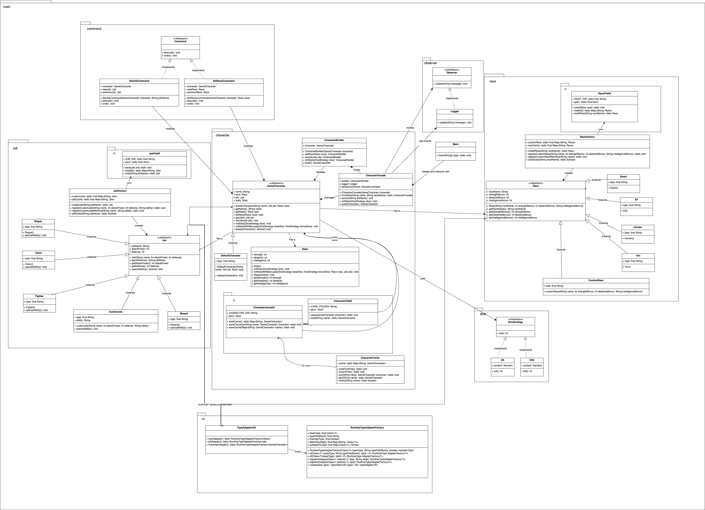
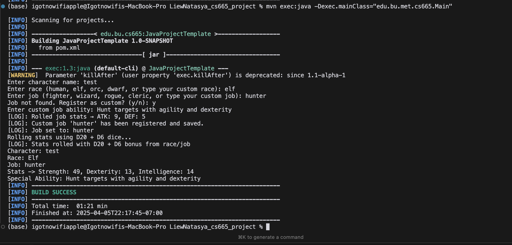

| CS-665       | Software Design & Patterns |
|--------------|----------------------------|
| Name         | Natasya Liew U15913137     |
| Date         | March 10, 2025             |
| Course       | Spring                     |
| Assignment # | Final Project              |

# Assignment Overview
The objective of this assignment was to design and implement an **RPG Character Creation System** using **object-oriented programming principles** and **design patterns** to ensure **modularity, scalability, and maintainability**. The system allows users to create characters by selecting a **race, job, and rolling stats** using different dice strategies. Additionally, it supports **custom race and job creation**, **command-based undo/redo functionality**, and **observer-based logging**.

The assignment focused on utilizing **design patterns** to enhance flexibility. We implemented the **Factory Pattern** for race and job creation, the **Builder Pattern** for character modification, the **Facade Pattern** for simplifying interactions, the **Strategy Pattern** for rolling dice, the **Observer Pattern** for event logging, and the **Command Pattern** for job and race modifications.


# GitHub Repository Link:
[GitHub Link](https://github.com/igotnowifi-official/cs-665-project)

# **UML Class Diagram**



## **📌 Class Object Details & Relationships**
The UML diagram provides a high-level view of the system's **class structure**, depicting **relationships and interactions** between components.

### **1️⃣ Core Classes**
#### **GameCharacter (Abstract)**
- Represents a character in the game.
- **Attributes**: `name`, `race`, `job`, `stats`.
- **Methods**: `getRace()`, `getJob()`, `setRace()`, `setJob()`, `rollStats()`, `displayCharacter()`.
- **Relationships**:
  - Associated with **Race** (`has a` relationship).
  - Associated with **Job** (`has a` relationship).
  - Aggregates **Stats** (`has a` relationship).

#### **DefaultCharacter (Concrete Class)**
- A concrete implementation of `GameCharacter`.
- **Relationships**:
  - Extends **GameCharacter** (`is a` relationship).

### **2️⃣ Job System**
#### **Job (Abstract)**
- Represents a **character job/class**.
- **Attributes**: `jobName`, `attackPower`, `defense`.
- **Methods**: `getJobName()`, `getAttackPower()`, `getDefense()`, `specialAbility()`.
- **Relationships**:
  - Extended by **predefined job classes** (`is a` relationship).

#### **Predefined Job Classes**
- **Fighter**, **Wizard**, **Rogue**, **Cleric** extend `Job`.
- Each implements **`specialAbility()`**.

#### **CustomJob**
- Allows users to **define new job classes dynamically**.
- **Extends** `Job` and inherits its properties.

#### **JobFactory**
- Implements the **Factory Pattern** to **create predefined and custom jobs**.
- **Methods**: `createJob()`, `registerCustomJob()`.
- **Relationships**:
  - Creates instances of **Job** (`creates` relationship).

### **3️⃣ Race System**
#### **Race (Abstract)**
- Represents a **character's race**.
- **Attributes**: `raceName`, `strengthBonus`, `dexterityBonus`, `intelligenceBonus`.
- **Methods**: `getRaceName()`, `getStrengthBonus()`, `getDexterityBonus()`, `getIntelligenceBonus()`.
- **Relationships**:
  - Extended by **predefined race classes** (`is a` relationship).

#### **Predefined Race Classes**
- **Human**, **Elf**, **Orc**, **Dwarf** extend `Race`.

#### **CustomRace**
- Allows users to **define new race types** dynamically.
- **Extends** `Race` and inherits its properties.

#### **RaceFactory**
- Implements the **Factory Pattern** to **create predefined and custom races**.
- **Methods**: `createRace()`, `registerCustomRace()`.
- **Relationships**:
  - Creates instances of **Race** (`creates` relationship).

### **4️⃣ Additional Components**
#### **CharacterBuilder**
- Implements the **Builder Pattern** for constructing characters.
- **Methods**: `setRace()`, `setJob()`, `rollStats()`, `build()`.
- **Relationships**:
  - Used by **CharacterFacade** (`used by` relationship).

#### **CharacterFacade**
- Implements the **Facade Pattern** to simplify character creation.
- **Methods**: `setRace()`, `setJob()`, `rollStats()`, `buildCharacter()`.
- **Relationships**:
  - Calls **CharacterBuilder** (`uses` relationship).
  - Calls **SetJobCommand**, **SetRaceCommand** (`uses` relationship).

#### **Stats**
- Stores and manages **Strength, Dexterity, Intelligence**.
- **Methods**: `applyBonuses()`, `rollStats()`, `getStrength()`, `getDexterity()`, `getIntelligence()`.
- **Relationships**:
  - Associated with **GameCharacter** (`has a` relationship).

#### **Command Pattern (Undo/Redo)**
- **SetJobCommand**, **SetRaceCommand** implement **Command**.
- **Methods**: `execute()`, `undo()`.
- **Relationships**:
  - Used by **CharacterFacade** (`used by` relationship).

#### **Observer Pattern**
- **Logger** implements **Observer**.
- **Methods**: `update()`.
- **Relationships**:
  - Observes **CharacterFacade** (`observes` relationship).

#### **Strategy Pattern**
- **DiceStrategy** implemented by **D6, D20**.
- **Methods**: `roll()`.
- **Relationships**:
  - Used by **Stats** to roll character attributes (`uses` relationship).


# Implementation Description 

## **1️⃣ Flexibility**
- The system is **highly flexible**, allowing **new jobs and races** to be added **without modifying existing code**.  
- This is achieved using **factories (`JobFactory`, `RaceFactory`)**, which register **new jobs and races dynamically**.  
- The **command pattern** (`SetJobCommand`, `SetRaceCommand`) allows **undo/redo functionality**, making it **adaptable for future enhancements**.

## **2️⃣ Simplicity & Understandability**
- The implementation follows **clear object-oriented design principles**, ensuring that **each class has a single responsibility**.  
- By using **modularized classes**, developers can easily **read, maintain, and extend** the codebase.  
- **Descriptive class and method names** improve **code readability**.

## **3️⃣ Avoiding Code Duplication**
- **Code duplication was minimized** by implementing:
  - **Factory Methods** → Centralized job and race creation logic.
  - **Abstract Base Classes (`GameCharacter`, `Job`, `Race`)** → Shared behaviors across multiple subclasses.
  - **Builder Pattern** → Simplifies character modification without redundant constructors.
  - **Strategy Pattern (`DiceStrategy`)** → Enables different dice implementations (`D6`, `D20`) without code duplication.
- Avoiding duplicated code improves **maintainability**, **reduces bugs**, and **enhances efficiency**.

## **4️⃣ Design Patterns Used**
| **Design Pattern** | **Purpose** |
|--------------------|-------------|
| **Factory Pattern** | Used in `JobFactory` and `RaceFactory` to create new jobs and races dynamically. |
| **Builder Pattern** | Implemented in `CharacterBuilder` to modify character attributes without complex constructors. |
| **Facade Pattern** | `CharacterFacade` simplifies interactions, providing a single interface for character creation. |
| **Strategy Pattern** | Used for dice rolling (`DiceStrategy`, `D6`, `D20`), making stat generation modular. |
| **Observer Pattern** | Implemented in `Logger`, which logs all character modifications and assignments. |
| **Command Pattern** | Used in `SetJobCommand` and `SetRaceCommand`, allowing undo/redo of job and race selections. |

By implementing **these patterns**, the system remains **scalable, maintainable, and easily extensible** for future features.

# Maven Commands

We'll use Apache Maven to compile and run this project. You'll need to install Apache Maven (https://maven.apache.org/) on your system. 

Apache Maven is a build automation tool and a project management tool for Java-based projects. Maven provides a standardized way to build, package, and deploy Java applications.

Maven uses a Project Object Model (POM) file to manage the build process and its dependencies. The POM file contains information about the project, such as its dependencies, the build configuration, and the plugins used for building and packaging the project.

Maven provides a centralized repository for storing and accessing dependencies, which makes it easier to manage the dependencies of a project. It also provides a standardized way to build and deploy projects, which helps to ensure that builds are consistent and repeatable.

Maven also integrates with other development tools, such as IDEs and continuous integration systems, making it easier to use as part of a development workflow.

Maven provides a large number of plugins for various tasks, such as compiling code, running tests, generating reports, and creating JAR files. This makes it a versatile tool that can be used for many different types of Java projects.

## Compile
Type on the command line: 

```bash
mvn clean compile
```


## Run Program

Type on the command line:

```bash
mvn exec:java -Dexec.mainClass="edu.bu.met.cs665.Main"
```



## JUnit Tests
JUnit is a popular testing framework for Java. JUnit tests are automated tests that are written to verify that the behavior of a piece of code is as expected.

In JUnit, tests are written as methods within a test class. Each test method tests a specific aspect of the code and is annotated with the @Test annotation. JUnit provides a range of assertions that can be used to verify the behavior of the code being tested.

JUnit tests are executed automatically and the results of the tests are reported. This allows developers to quickly and easily check if their code is working as expected, and make any necessary changes to fix any issues that are found.

The use of JUnit tests is an important part of Test-Driven Development (TDD), where tests are written before the code they are testing is written. This helps to ensure that the code is written in a way that is easily testable and that all required functionality is covered by tests.

JUnit tests can be run as part of a continuous integration pipeline, where tests are automatically run every time changes are made to the code. This helps to catch any issues as soon as they are introduced, reducing the need for manual testing and making it easier to ensure that the code is always in a releasable state.

To run, use the following command:
```bash
mvn clean test
```


## Spotbugs 

SpotBugs is a static code analysis tool for Java that detects potential bugs in your code. It is an open-source tool that can be used as a standalone application or integrated into development tools such as Eclipse, IntelliJ, and Gradle.

SpotBugs performs an analysis of the bytecode generated from your Java source code and reports on any potential problems or issues that it finds. This includes things like null pointer exceptions, resource leaks, misused collections, and other common bugs.

The tool uses data flow analysis to examine the behavior of the code and detect issues that might not be immediately obvious from just reading the source code. SpotBugs is able to identify a wide range of issues and can be customized to meet the needs of your specific project.

Using SpotBugs can help to improve the quality and reliability of your code by catching potential bugs early in the development process. This can save time and effort in the long run by reducing the need for debugging and fixing issues later in the development cycle. SpotBugs can also help to ensure that your code is secure by identifying potential security vulnerabilities.

Use the following command:

```bash
mvn spotbugs:gui 
```


For more info see 
https://spotbugs.readthedocs.io/en/latest/maven.html

SpotBugs https://spotbugs.github.io/ is the spiritual successor of FindBugs.


## Checkstyle 

Checkstyle is a development tool for checking Java source code against a set of coding standards. It is an open-source tool that can be integrated into various integrated development environments (IDEs), such as Eclipse and IntelliJ, as well as build tools like Maven and Gradle.

Checkstyle performs static code analysis, which means it examines the source code without executing it, and reports on any issues or violations of the coding standards defined in its configuration. This includes issues like code style, code indentation, naming conventions, code structure, and many others.

By using Checkstyle, developers can ensure that their code adheres to a consistent style and follows best practices, making it easier for other developers to read and maintain. It can also help to identify potential issues before the code is actually run, reducing the risk of runtime errors or unexpected behavior.

Checkstyle is highly configurable and can be customized to fit the needs of your team or organization. It supports a wide range of coding standards and can be integrated with other tools, such as code coverage and automated testing tools, to create a comprehensive and automated software development process.

The following command will generate a report in HTML format that you can open in a web browser. 

```bash
mvn checkstyle:checkstyle
```


The HTML page will be found at the following location:
`target/site/checkstyle.html`


