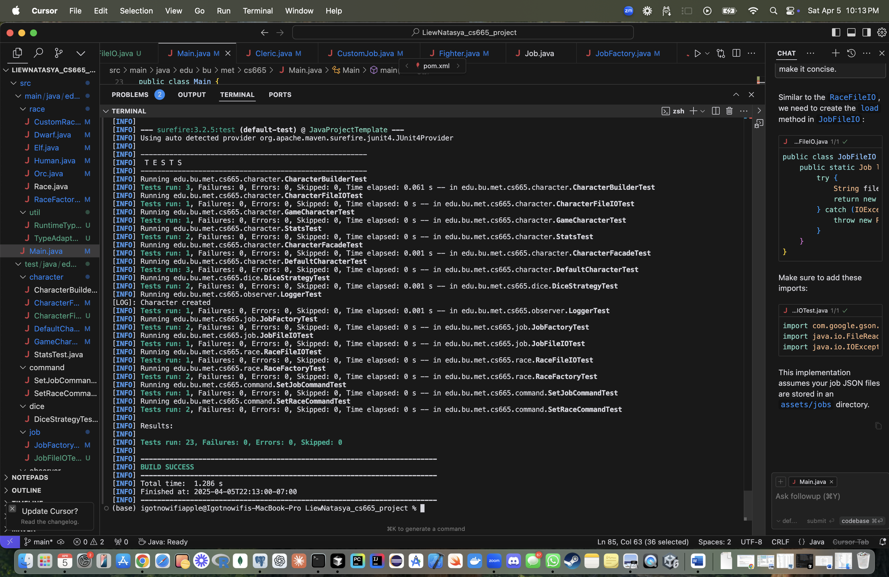

| CS-665       | Software Design & Patterns |
|--------------|----------------------------|
| Name         | Natasya Liew U15913137     |
| Date         | March 10, 2025             |
| Course       | Spring                     |
| Assignment # | Final Project              |

# Assignment Overview
This project implements an **RPG Character Creation System** using **object-oriented design** and multiple **software design patterns** to maximize **flexibility**, **maintainability**, and **scalability**. The system allows users to:

- Create characters by choosing a race and job
- Roll stats using dice strategies
- Define and reuse **custom races and jobs**
- **Persist character data** to individual JSON files
- Support **undoable race/job commands**
- Log all actions automatically

## 🎯 Key Features & Practices
- Object-Oriented Design
- SOLID Principles
- Test-Driven Development with JUnit
- Modular File I/O with Gson & Adapter Factories
- Reusable JSON serialization across components
- Code quality tools: **Checkstyle**, **SpotBugs**
- Clean architecture and documentation
- Uses Maven for build, dependency, and test management

# GitHub Repository Link:
[GitHub Link](https://github.com/igotnowifi-official/cs-665-project)

# **UML Class Diagram**


## **📌 Class Object Details & Relationships**
The UML diagram provides a high-level view of the system's **class structure**, depicting **relationships and interactions** between components.

### **1️⃣ Core Classes**
#### **GameCharacter (Abstract)**
- Represents a character in the game.
- **Attributes**: `name`, `race`, `job`, `stats`
- **Methods**: `getRace()`, `getJob()`, `setRace()`, `setJob()`, `rollStats()`, `displayCharacter()`
- **Relationships**:
  - Aggregates **Stats**
  - Has-a **Race**
  - Has-a **Job**

#### **DefaultCharacter (Concrete Class)**
- Concrete implementation of `GameCharacter`.
- **Relationships**:
  - `is-a` **GameCharacter**

---

### **2️⃣ Job System**
#### **Job (Abstract)**
- Base class for all jobs.
- **Attributes**: `jobName`, `attackPower`, `defense`
- **Methods**: `getJobName()`, `getAttackPower()`, `getDefense()`, `specialAbility()`
- **Relationships**:
  - `is-a` superclass for predefined and custom jobs

#### **Predefined Jobs**
- **Fighter**, **Wizard**, **Rogue**, **Cleric**
- Each overrides `specialAbility()`

#### **CustomJob**
- User-defined jobs with unique abilities
- **Relationships**: `extends` Job

#### **JobFactory**
- Uses **Factory Pattern**
- **Methods**: `createJob()`, `registerCustomJob()`, `registerCustomJobWithDice()`
- **Relationships**: creates instances of `Job` and handles file I/O via `JobFileIO`

---

### **3️⃣ Race System**
#### **Race (Abstract)**
- Base class for all races.
- **Attributes**: `raceName`, `strengthBonus`, `dexterityBonus`, `intelligenceBonus`
- **Methods**: `getRaceName()`, `getStrengthBonus()`, `getDexterityBonus()`, `getIntelligenceBonus()`
- **Relationships**:
  - `is-a` superclass for predefined and custom races

#### **Predefined Races**
- **Human**, **Elf**, **Orc**, **Dwarf**

#### **CustomRace**
- User-defined race
- **Relationships**: `extends` Race

#### **RaceFactory**
- Uses **Factory Pattern**
- **Methods**: `createRace()`, `registerCustomRace()`, `registerCustomRaceWithDice()`
- **Relationships**: creates instances of `Race` and handles file I/O via `RaceFileIO`

---

### **4️⃣ Additional Components**
#### **CharacterBuilder**
- Implements **Builder Pattern**
- **Methods**: `setRace()`, `setJob()`, `rollStats()`, `build()`
- **Relationships**: used by `CharacterFacade`

#### **CharacterFacade**
- Implements **Facade Pattern**
- Simplifies creation logic
- **Methods**: `fromNew()`, `setJob()`, `rollStats()`, `buildCharacter()`
- **Relationships**:
  - Uses `CharacterBuilder`
  - Applies `Command Pattern` (`SetJobCommand`, `SetRaceCommand`)
  - Notifies via `Logger`

#### **CharacterCache**
- Implements **Cache Pattern**
- Caches characters in memory and saves them using `CharacterCacheIO`

#### **Stats**
- Represents stat container
- **Attributes**: `strength`, `dexterity`, `intelligence`
- **Methods**: `rollStats()`, `rollStatsWithBonuses()`, `displayStats()`

---

### **5️⃣ Design Patterns Overview**
| **Pattern**      | **Applied To**                                      | **Purpose**                                                       |
|------------------|-----------------------------------------------------|-------------------------------------------------------------------|
| Factory          | `RaceFactory`, `JobFactory`                         | Centralized creation logic for Race and Job subclasses            |
| Builder          | `CharacterBuilder`                                  | Allows flexible, incremental construction of characters           |
| Facade           | `CharacterFacade`                                   | Simplifies character creation process                             |
| Strategy         | `DiceStrategy`, `D6`, `D20`                          | Encapsulates rolling logic for stat generation                    |
| Command          | `SetJobCommand`, `SetRaceCommand`                   | Enables undoable changes to character state                       |
| Observer         | `Logger`                                            | Logs character updates                                            |
| Cache            | `CharacterCache`, `CharacterCacheIO`                | Caches and persists GameCharacter instances efficiently           |
| Polymorphic JSON | `RuntimeTypeAdapterFactory`, `TypeAdapterUtil`      | Handles abstract serialization of GameCharacter, Race, and Job    |


By implementing **these patterns**, the system remains **scalable, maintainable, and easily extensible** for future features.

# Maven Commands

We'll use Apache Maven to compile and run this project. You'll need to install Apache Maven (https://maven.apache.org/) on your system. 

Apache Maven is a build automation tool and a project management tool for Java-based projects. Maven provides a standardized way to build, package, and deploy Java applications.

Maven uses a Project Object Model (POM) file to manage the build process and its dependencies. The POM file contains information about the project, such as its dependencies, the build configuration, and the plugins used for building and packaging the project.

Maven provides a centralized repository for storing and accessing dependencies, which makes it easier to manage the dependencies of a project. It also provides a standardized way to build and deploy projects, which helps to ensure that builds are consistent and repeatable.

Maven also integrates with other development tools, such as IDEs and continuous integration systems, making it easier to use as part of a development workflow.

Maven provides a large number of plugins for various tasks, such as compiling code, running tests, generating reports, and creating JAR files. This makes it a versatile tool that can be used for many different types of Java projects.

## Compile
Type on the command line: 

```bash
mvn clean compile
```


## Run Program

Type on the command line:

```bash
mvn exec:java -Dexec.mainClass="edu.bu.met.cs665.Main"
```


## JUnit Tests
JUnit is a popular testing framework for Java. JUnit tests are automated tests that are written to verify that the behavior of a piece of code is as expected.

In JUnit, tests are written as methods within a test class. Each test method tests a specific aspect of the code and is annotated with the @Test annotation. JUnit provides a range of assertions that can be used to verify the behavior of the code being tested.

JUnit tests are executed automatically and the results of the tests are reported. This allows developers to quickly and easily check if their code is working as expected, and make any necessary changes to fix any issues that are found.

The use of JUnit tests is an important part of Test-Driven Development (TDD), where tests are written before the code they are testing is written. This helps to ensure that the code is written in a way that is easily testable and that all required functionality is covered by tests.

JUnit tests can be run as part of a continuous integration pipeline, where tests are automatically run every time changes are made to the code. This helps to catch any issues as soon as they are introduced, reducing the need for manual testing and making it easier to ensure that the code is always in a releasable state.

The project uses **JUnit 4.13.1** with **100% test coverage** on:

- `CharacterBuilder`, `CharacterFacade`, `DefaultCharacter`, `Stats`, `GameCharacter`
- `SetJobCommand`, `SetRaceCommand`
- `JobFactory`, `RaceFactory`, `JobFileIO`, `RaceFileIO`
- Custom characters (e.g., `goddess`, `titans`) loaded from actual JSON files

To run, use the following command:
```bash
mvn clean test
```



## Spotbugs 

SpotBugs is a static code analysis tool for Java that detects potential bugs in your code. It is an open-source tool that can be used as a standalone application or integrated into development tools such as Eclipse, IntelliJ, and Gradle.

SpotBugs performs an analysis of the bytecode generated from your Java source code and reports on any potential problems or issues that it finds. This includes things like null pointer exceptions, resource leaks, misused collections, and other common bugs.

The tool uses data flow analysis to examine the behavior of the code and detect issues that might not be immediately obvious from just reading the source code. SpotBugs is able to identify a wide range of issues and can be customized to meet the needs of your specific project.

Using SpotBugs can help to improve the quality and reliability of your code by catching potential bugs early in the development process. This can save time and effort in the long run by reducing the need for debugging and fixing issues later in the development cycle. SpotBugs can also help to ensure that your code is secure by identifying potential security vulnerabilities.

Use the following command:

```bash
mvn spotbugs:gui 
```


For more info see 
https://spotbugs.readthedocs.io/en/latest/maven.html

SpotBugs https://spotbugs.github.io/ is the spiritual successor of FindBugs.


## Checkstyle 

Checkstyle is a development tool for checking Java source code against a set of coding standards. It is an open-source tool that can be integrated into various integrated development environments (IDEs), such as Eclipse and IntelliJ, as well as build tools like Maven and Gradle.

Checkstyle performs static code analysis, which means it examines the source code without executing it, and reports on any issues or violations of the coding standards defined in its configuration. This includes issues like code style, code indentation, naming conventions, code structure, and many others.

By using Checkstyle, developers can ensure that their code adheres to a consistent style and follows best practices, making it easier for other developers to read and maintain. It can also help to identify potential issues before the code is actually run, reducing the risk of runtime errors or unexpected behavior.

Checkstyle is highly configurable and can be customized to fit the needs of your team or organization. It supports a wide range of coding standards and can be integrated with other tools, such as code coverage and automated testing tools, to create a comprehensive and automated software development process.

The following command will generate a report in HTML format that you can open in a web browser. 

```bash
mvn checkstyle:checkstyle
```


The HTML page will be found at the following location:
`target/site/checkstyle.html`

## 📦 JSON Sample (Character)

```json
{
  "type": "default",
  "name": "natasya",
  "race": {
    "type": "custom",
    "raceName": "titans",
    "strengthBonus": 999999,
    "dexterityBonus": 999999,
    "intelligenceBonus": 999999
  },
  "job": {
    "type": "custom",
    "jobName": "goddess",
    "attackPower": 9999999,
    "defense": 9999999,
    "ability": "Divine Judgment"
  },
  "stats": {
    "strength": 9999999,
    "dexterity": 9999999,
    "intelligence": 9999999
  }
}
```


